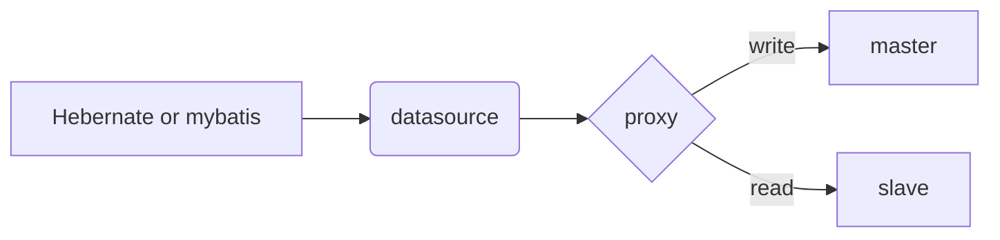

# MySQL

## 索引

最小匹配原则

## 优化

explain可以分析SQL语句执行情况。

|               | 说明                             |
| ------------- | -------------------------------- |
| id            | 序号                             |
| select_type   | 语句类型                         |
| table         | 操作的表                         |
| type          | 使用的JOIN类型                   |
| possible_keys | 如果包含主键索引，可用的字段列表 |
| key           | 被优化器选中的主键               |
| key_len       | 主键或部分主键长度               |
| ref           | 约束或需要对比的字段             |
| rows          | 预计需要处理的行数               |
| extra         | 额外信息                         |

其中type如果是ALL表明是全表扫描，如果是INDEX表明是全索引扫描，都需要避免。

##备份

## 读写分离

### MySQL配置

### 应用配置

有的人从数据库访问框架下手，有的人从数据库连接池下手。但是常用的应该是在应用和数据库之间，加一层代理，让代理进行路由抓发以支持读写分离的多数据源。

mysql-proxy由mysql官方出品，mycat由阿里出品。官方不推荐在生产环境使用mysql-proyx，推荐使用MySQL Router。

一个mysql代理需要什么功能：

- 读写分离
- 代理的高可用
- 分库分表
- SQL白名单
- 审计
- 监控和统计
- 防火墙

